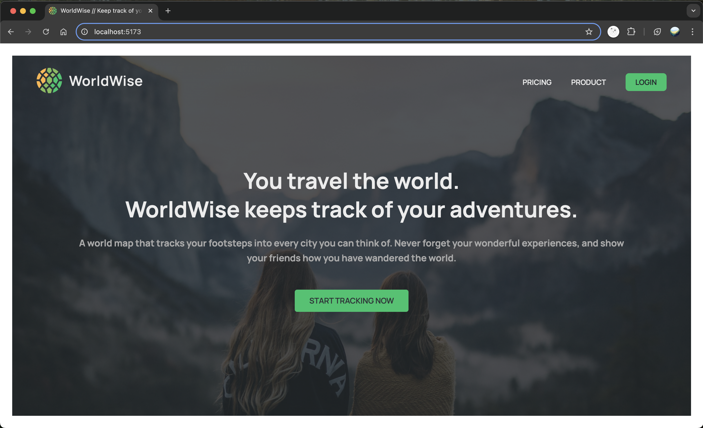

**WorldWise**

WorldWise is your ultimate travel companion, helping you track your footsteps across the globe by pinning every city you’ve visited on a world map. Relive your adventures, document your travel experiences, and showcase your journeys to inspire friends and family. Explore, remember, and share your story!



**Features**

- **Interactive World Map**: Pin every city you’ve visited and visualize your global adventures.

- **Personal Travel Log**: Record details of your trips, including memorable experiences and highlights.

- **Shareable Journey**: Showcase your travels with friends and family through an easy-to-share map.

- **User-Friendly Interface**: A React-based design ensures smooth and responsive interactions.

**Prerequisites**

Before you begin, make sure you have the following installed on your local machine:

- **Node.js** (version 14 or higher)

- **npm** (Node package manager)

**Setup Instructions**

**1\. Clone the Repository**

First, clone the repository to your local machine:

```bash
git clone https://github.com/aaqib605/worldwise.git

cd worldwise
```

**2\. Install Dependencies**

Next, install the required npm packages by running:

```bash
npm install
```

**3\. Run the JSON Server**

In a separate terminal session, run the following command to start a fake API server.

```bash
npm run server
```

**4\. Start the Development Server**

To start the development server and run the application, use the following command:

```bash
npm run dev
```

Once the server starts, open your browser and visit http://localhost:5173 to see the app in action.
